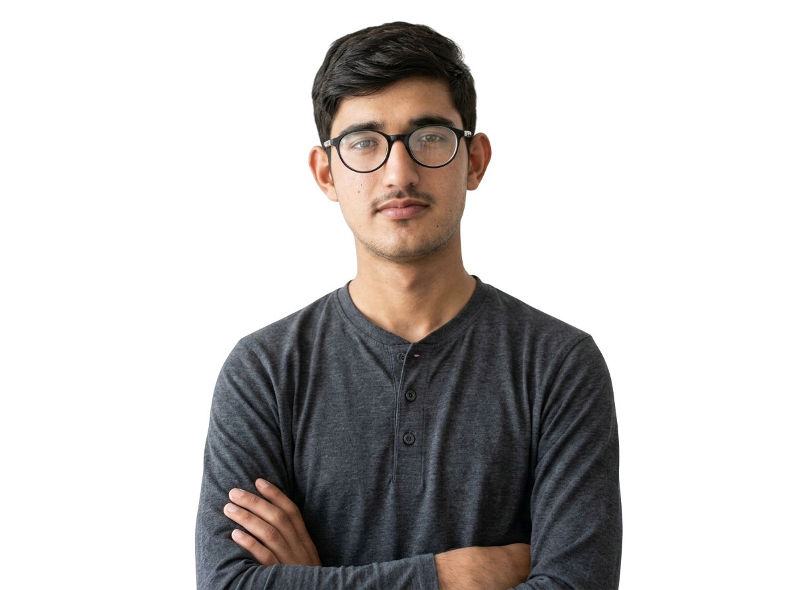

<div align="center">



# Abdullah Liaqat

### Web Developer · Front-End & WordPress Specialist

[](https://abdullah-web-dev-portfolio.vercel.app/)
[](https://www.linkedin.com/in/abdullah-liaqat-480a60387)
[](mailto:abdullahliaqat416@gmail.com)
[](https://github.com/abdullahliaqat416-coder)

</div>

---

## 👋 About This Portfolio

This repository is the source code behind my personal **web developer portfolio** — a live showcase of the responsive websites, landing pages, and client projects I've designed and built.

🔗 **Live Site:** [abdullah-web-dev-portfolio.vercel.app](https://abdullah-web-dev-portfolio.vercel.app/)

I'm a web developer with hands-on experience designing, building, and maintaining responsive, high-performance websites — from front-end interfaces to WordPress-based content and e-commerce systems. I focus on clean code, real usability, and delivering production-ready results.

---

## ✨ Highlights

- 🎨 Clean, modern, fully responsive design (desktop, tablet, mobile)
- ⚡ Optimized for speed and performance
- 🖼️ Live project showcase with direct demo links
- 🛒 Experience with e-commerce, landing pages, and full websites
- 🌐 Cross-browser tested and production-ready

---

## 🛠️ Tech Stack

| Category | Technologies |
|---|---|
| **Front-End** | HTML5, CSS3, JavaScript |
| **CMS** | WordPress (Elementor & Gutenberg) |
| **Design** | Figma (UI/UX & Wireframing) |
| **Deployment** | Vercel |
| **Version Control** | Git & GitHub |

---

## 📂 Project Structure
├── index.html
├── assets/
│  css/
│  js/
│  images/
└── README.md


---

## 🚀 Run Locally

```bash
git clone https://github.com/abdullahliaqat416-coder/<repo-name>.git
cd <repo-name>
```

No build step needed — just open `index.html` in your browser, or serve it with a local dev server.

---

## 📬 Get In Touch

**Abdullah Liaqat**
Web Developer | Okara, Punjab, Pakistan

- 📧 [abdullahliaqat416@gmail.com](mailto:abdullahliaqat416@gmail.com)
- 💼 [LinkedIn](https://www.linkedin.com/in/abdullah-liaqat-480a60387)
- 🌐 [Portfolio](https://abdullah-web-dev-portfolio.vercel.app/)

---

<div align="center">

### ⭐ If you like this portfolio, consider giving this repo a star — it really helps!

<sub>Made with care by Abdullah Liaqat</sub>

</div>
